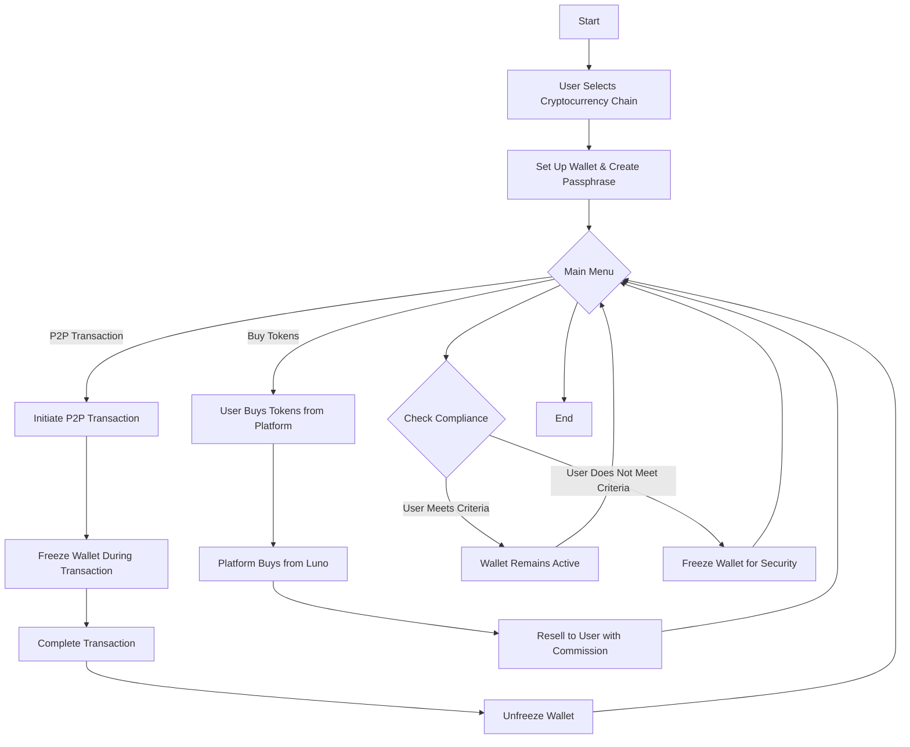

---

  

#  Crypto Wallet and Transaction System Documentation

  

This documentation provides a clear, user-friendly breakdown of the cryptocurrency platform’s functionality. It explains how users create and manage wallets, make transactions, and buy tokens directly within the app. The guide will help your design and development teams align on both user experience and technical requirements for the platform.

  

---

  

##  Overview

  

This system allows users to create crypto wallets, perform transactions using a secure and straightforward process, and even buy cryptocurrency directly through the app. It is designed for accessibility, enabling users to manage their crypto easily, with robust security measures in place for data protection and transaction integrity.

  

Users register with essential details, including a phone number as their unique identifier for transactions and wallet linking.

  

---

  

##  Key User Actions

  

1.  **User Registration**: Sign up with username, name, email, password, and phone number (unique identifier).

2.  **Wallet Creation and Selection**: Users can create wallets for various supported cryptocurrencies, each requiring its own wallet.

3.  **Secure Transactions**: Users can conduct transactions using a recipient’s phone number, with additional peer-to-peer (P2P) transaction options.

4.  **Pending Transactions for New Users**: Transactions to non-registered users remain pending until they join the platform.

5.  **P2P Transactions**: Facilitates direct crypto transfers between registered users.

6.  **Buying Cryptocurrency Directly**: Users can buy crypto directly from the platform, which purchases it from third-party providers and resells it with a small commission.

  

---

  

##  User Journey Mapping

  

Here is a step-by-step guide to the user’s journey, covering each action and illustrating the backend processes involved.

  

###  1. User Registration

  

-  **Inputs Required**:

- Username

- First and Last Name

- Email Address

- Password

- Phone Number (serves as the unique identifier for transactions)

-  **Process**:

- Users submit their details.

- The system verifies the phone number’s uniqueness.

  

-  **Outcome**:

- Upon successful registration, the user is redirected to their dashboard, ready to set up wallets.

  

###  2. Selecting a Chain and Adding Wallets

  

-  **Purpose**: Allow users to set up wallets for specific cryptocurrencies like Bitcoin (BTC), Ethereum (ETH), or Tether (USDT).

-  **Action**:

- Users choose a cryptocurrency network (chain) from a list provided in the app.

- For each selected chain, the system creates a separate wallet, as required by blockchain protocols.

- The wallet information, including wallet ID and balance, is securely stored in the user’s profile.

  

-  **User Interface Guidance**:

- Display a list of supported cryptocurrencies.

- Provide clear instructions for setting up wallets.

- Show wallet details such as balance and transaction history in an accessible format.

  

###  3. Passphrase Security for Wallets

  

-  **Purpose**: To protect user wallets and transactions, ensuring data privacy.

-  **Action**:

- During wallet setup, users create a secure passphrase.

- The passphrase is encrypted and hashed, which means it cannot be accessed by anyone else, including the platform’s development team.

  

-  **User Interface Guidance**:

- Educate users about the importance of a secure passphrase and encourage unique, strong passphrases.

- Notify users that the passphrase is encrypted for privacy, giving them peace of mind.

  

###  4. Transactions Using Phone Number

  

1.  **Initiating a Transaction**:

- Users select a recipient by entering their phone number.

- They input the amount and select the cryptocurrency for the transaction.

  

2.  **Process**:

- The system checks if the recipient’s phone number is registered.

- If the recipient is registered:

- The transaction is processed, and both users receive notifications.

- If the recipient is not registered:

- The transaction is saved as "Pending" until the recipient registers.

  

3.  **User Interface Guidance**:

- Use intuitive prompts to guide users through each transaction step.

- Display pending transactions prominently on the sender's dashboard, especially for transactions awaiting recipient registration.

  

###  5. Peer-to-Peer (P2P) Transactions

  

1.  **Purpose**: Enable users to transfer cryptocurrency directly to other registered users.

2.  **Process**:

- Users initiate a P2P transaction, similar to a bank transfer, which includes a small transaction fee for the platform.

- Wallets are temporarily frozen during the transaction to ensure there are no disruptions, and the transaction is securely processed.

  

3.  **User Interface Guidance**:

- Provide an easily accessible “P2P Transaction” option.

- Show real-time transaction confirmations and clear notifications for both sender and recipient.

  

###  6. Buying Tokens from the Platform

  

1.  **Purpose**: Allow users to buy cryptocurrency directly from within the app.

2.  **How It Works**:

- The platform purchases the cryptocurrency from a third-party exchange (e.g., Luno) and resells it to users.

- A small commission fee is included in the transaction to generate revenue.

3.  **User Interface Guidance**:

- Create a “Buy Crypto” section where users can view real-time prices and proceed with purchases.

- Show users a clear breakdown of transaction fees and final prices for transparency.

  

###  7. Wallet Freezing During Transactions

  

-  **Purpose**: Ensures security and transaction integrity.

-  **When**:

- During any active transaction, such as a transfer or P2P transaction, the wallet is temporarily frozen.

- Additionally, if a user violates compliance criteria, their wallet may be frozen for security reasons.

  

---

  

##  Technical Concepts

  

###  Wallet Architecture

  

-  **Individual Wallets for Cryptocurrencies**: Each cryptocurrency requires its own wallet due to blockchain and API limitations. Users wishing to transact with multiple coins will therefore need a separate wallet for each.

-  **Secure Storage**: Wallets are stored with unique IDs and can be accessed only by authorized users through the API.

  

###  System Processes

  

-  **Create Wallet**:

- When a user requests a wallet, the system generates it via API, storing the wallet details securely in the user’s profile.

-  **Create Address**:

- Users can request new addresses within a wallet, and the system will handle address generation through the API.

-  **Send Transaction**:

- For any initiated transaction, the system verifies the recipient’s details and processes the payment. The transaction status is tracked (e.g., pending, completed).

-  **Get Wallet Balance**:

- Users can retrieve real-time wallet balances on demand.

  

---

  

##  Example System Actions

  

1.  **Pending Transactions for Unregistered Users**:

- The system periodically checks for new user registrations to match with pending transactions, automatically completing them when a match is found.

2.  **User Notifications**:

- Notifications should be integrated into the design to confirm transactions, update balances, and remind recipients about pending registrations.

3.  **Transaction History**:

- Display a transaction history that includes all pending, completed, and failed transactions to ensure transparency.

  

---

  

##  Visual Flowchart of the Process

  

Below is a `Mermaid` flowchart to visually map the entire process from selecting chains to wallet security, P2P transactions, and token purchases:

  

  

---
